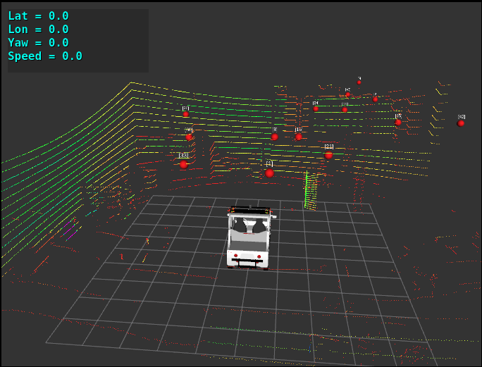
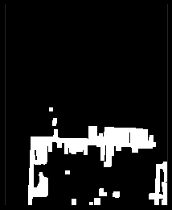
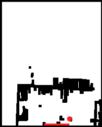

## Some Results:

Lidar output:

<a href="url"></a>

Lidar top view:

<a href="url"></a>

Lidar top view with pedestrian highlighted:

<a href="url"></a>

## Usage

#### Terminal 1
```
cd polaris_gem_e2_gps_wp_tracker/  
catkin_make  
source devel/setup.bash  
roslaunch basic_launch gnss_sensor_init.launch
```
#### Terminal 2
```
cd polaris_gem_e2_gps_wp_tracker/  
source devel/setup.bash  
roslaunch basic_launch gnss_visualization.launch
```
#### Terminal 3
```
cd polaris_gem_e2_gps_wp_tracker/  
source devel/setup.bash  
roslaunch basic_launch dbw_joystick.launch
```
#### Terminal 4
```
cd polaris_gem_e2_gps_wp_tracker/  
source devel/setup.bash  
rosrun gem_gnss gem_gnss_pp_tracker_pid.py
```